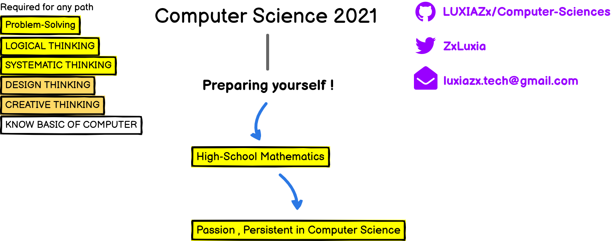
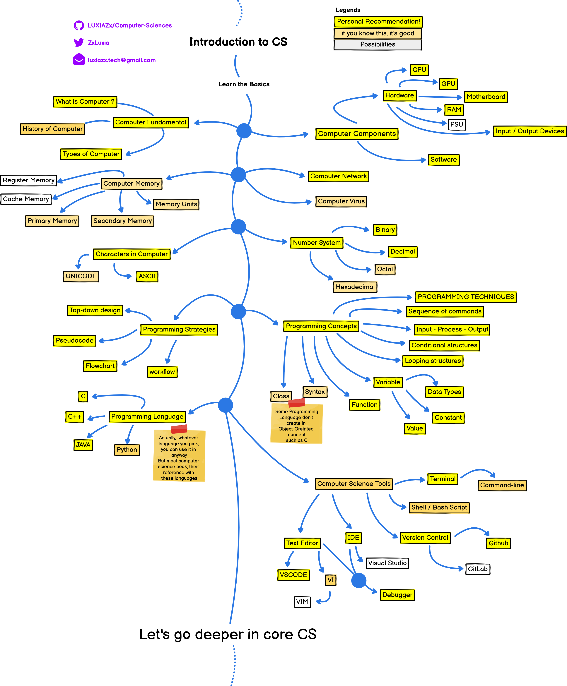
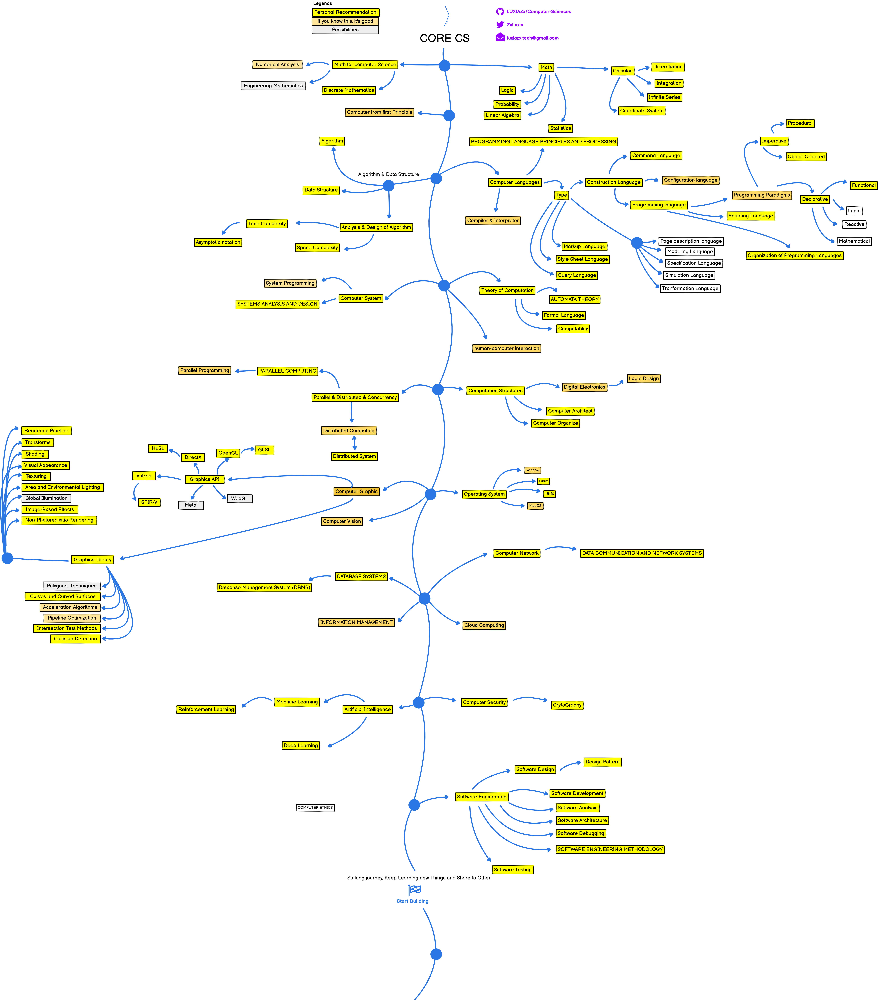
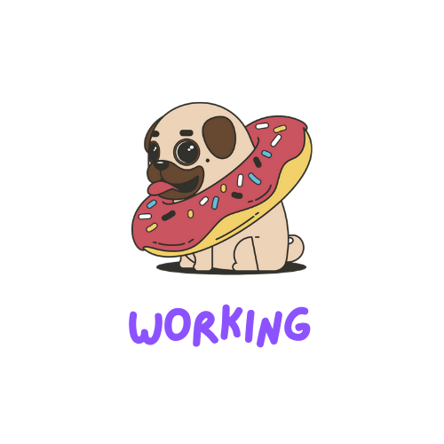

***

> Roadmap to becoming a computer scientist in 2021.
> Inspired by [web-dev-roadmap](https://github.com/kamranahmedse/developer-roadmap)

***

Below you find a set of charts demonstrating the paths that you can take and the subject fields or subject  that you want to adopt in order to become good computer scientist.  I made these charts for an old professor of mine who wanted something to share with his college students to give them a perspective;

<b>sharing them here to help the community.</b>

> Check out my [Github](www.github.com/LUXIAZx) or say "Hi" in My [twitter](https://twitter.com/ZxLuxia) 🐦

***

<h3 align="center"><strong>Purpose of these Roadmaps</strong></h3>

> The purpose of these roadmaps is to give you an idea about the landscape and to guide you if you are confused about what to learn next and not to encourage you to pick what is hip and trendy. You should grow some understanding of why one tool would be better suited for some cases than the other and remember hip and trendy never means best suited for the job.

***

<h3 align="center"><strong>Note to Beginners</strong></h3>

> These roadmaps cover everything that is there to learn for the paths listed below. 
> _Don't feel overwhelmed_,
> you don't need to learn it all in the beginning if you are just getting started. We are working on the beginner versions of these and will release it soon after we are done with the 2020 release of roadmaps.

***

> If you think that these can be improved in any way, please do suggest.

***

# Prerequisite 📝

***

# Introduction CS 🧑‍🎓

***
# Core CS  📚

> ⚠️ Current working :factory_worker:

***
# Advance CS 🚀 👾

***
# Branches of Computer Sciences

***
# 🚧 Wrap up

if you think any of the roadmaps can be improved, please do open a PR with any updates and submit any issues. Also, I will continue to improve this, so you might want to watch/star this repository to revisit.

***

# 🙌 Contribution

The roadmaps are built using [Balsamiq](https://balsamiq.com/wireframes/). Project file can be found at /project-files directory. To modify any of the roadmaps, open Balsamiq, 
Click __Project > Import > Mockup JSON__, it will open the roadmap for you, update it, upload and update the images in readme and create a PR.

* Open pull request with improvements
* Discuss ideas in issues
* Spread the word
* Reach out to me directly at luxiazx.tech@gmail.com

# 🚥 License

The class is licensed under the [MIT License](http://opensource.org/licenses/MIT):

Copyright &copy; 2020 [Thanawit Udompol](http://www.github.com/LUXIAZx).

Permission is hereby granted, free of charge, to any person obtaining a copy of this software and associated documentation files (the "Software"), to deal in the Software without restriction, including without limitation the rights to use, copy, modify, merge, publish, distribute, sublicense, and/or sell copies of the Software, and to permit persons to whom the Software is furnished to do so, subject to the following conditions:

The above copyright notice and this permission notice shall be included in all copies or substantial portions of the Software.

THE SOFTWARE IS PROVIDED "AS IS", WITHOUT WARRANTY OF ANY KIND, EXPRESS OR IMPLIED, INCLUDING BUT NOT LIMITED TO THE WARRANTIES OF MERCHANTABILITY, FITNESS FOR A PARTICULAR PURPOSE AND NONINFRINGEMENT. IN NO EVENT SHALL THE AUTHORS OR COPYRIGHT HOLDERS BE LIABLE FOR ANY CLAIM, DAMAGES OR OTHER LIABILITY, WHETHER IN AN ACTION OF CONTRACT, TORT OR OTHERWISE, ARISING FROM, OUT OF OR IN CONNECTION WITH THE SOFTWARE OR THE USE OR OTHER DEALINGS IN THE SOFTWARE.
